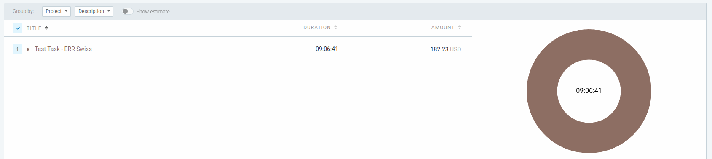

## Spent Time on task


## Booking Appointment
Test Task for ERP Swiss company !

## Install

```sh
npm install
```

```sh
npm run gulp
```

```sh
npm run start
```

## Notes
HTML, CSS, and JavaScript/jQuery files implementing the UI and functionality.

## Challenges
Was a little bit difficult to implement the JSON data in the right way, for correct multilevel menu.

## Demo
<a href="https://soltonanna.github.io/booking--appointment/" target="_blank"> Demo </a>
